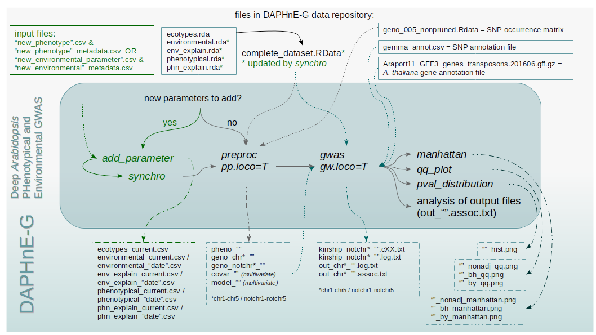

# DAPHnE-G


# Introduction
DAPHnE-G or Deep *Arabidopsis* PHenotypical and Environmental GWAS, is an R pipeline for GWAS analysis in *Arabidopsis thaliana*. It handles a data repository with different phenotypic and environmental parameters and it takes care of the association study from the first data preprocessing to the downstream analysis of results. 

The tool is quite modular and flexible and it will suite plant biologists who work with *A.thaliana*, as DAPHnE-G is taylored specifically for this organism. On the other hand the modularity of the structure could allow the implementation of other data repositories for different organisms.

The pipeline has been developed in order to collect and automatize part of the analysis used in the *SNPstar* webserver. This is a comprehensive database/data repository that aims to characterize the ecotypes of *A.thaliana* for mutations, associations and differences in sequences and structures are concerned. Among the provided resources it has been developed also a tool to calculate associations with phenotypical and environmental traits.


# Requirements
The pipeline is implemented in R  (version 3.6.1). In particular the following packages are needed: filesstrings (version 3.1.5), dplyr (version 0.8.3), MASS (version 7.3-51.4), ggplot2 (version 3.2.1).

For development and testing the following packages have been exploited: devtools (version 2.2.1), roxygen2 (version 7.0.0), checkmate (version 1.9.4), testthat (version 2.3.0), rmarkdown (version 1.17), knitr (version 1.26), docopt (version 0.6.1).

The GWAS analysis is carried out by the tool GEMMA (version 0.98.1).

# How to install
## R CMD INSTALL
- Download the zip from the github online repository
- Decompress it 
- Build the tarball (tar -czvf daphneg2-master.tar.gz daphneg2-master)
- R CMD INSTALL daphneg2-master.tar.gz

## git clone
- clone the git repository (git clone https://github.com/pezzcvd/daphneg2)
- Build the tarball (tar -czvf daphneg2-master.tar.gz daphneg2-master)
- R CMD INSTALL daphneg2-master.tar.gz

## devtools:install_github
- install.packages("devtools")
- library(devtools)
- install_github("pezzcvd/daphneg2")

## Program structure and workflow

### Workflow including all chromosomes(loco=F)


### Workflow including all chromosomes(loco=T)"



# Examples

## Add parameter to data collection
```{r}
# Example with environmental data
#' fl = system.file("extdata", "example_add_param.csv", package = "daphneg2")
#' mt = system.file("extdata", "example_add_param_meta.csv", package = "daphneg2")
#' add_param(fl, mt, TRUE)
#' synchro()
```

## Data preprocessing (univariate)
```{r}
# Example with environmental data
#' gen = system.file("extdata", "example_geno.RData", package = "daphneg2")
#' preproc("CO_Spring", "E", gen)
```

## Data preprocessing (univariate, leave-one-chromosome-out)
```{r}
# Example with environmental data
#' gen = system.file("extdata", "example_geno.RData", package = "daphneg2")
#' preproc("CO_Spring", "E", gen, pp.loco = T)
```

## Data preprocessing (multivariate, one covariate)
```{r}
# Example with environmental data
#' gen = system.file("extdata", "example_geno.RData", package = "daphneg2")
#' preproc("CO_Spring", "ExE", gen, "ET")
```

## Data preprocessing (multivariate, n covariates)
```{r}
# Example with environmental data
#' gen = system.file("extdata", "example_geno.RData", package = "daphneg2")
#' preproc("CO_Spring", "ExE", gen, "all")
```

## Association study (univariate)
```{r}
# Example with environmental data
#' gwas(gemma.name = "gemma-0.98.1-linux-static", gw.input = "CO_Spring", gw.cv = 0, gw.annot = "inst/extdata/gemma_annot_example.csv")
```

## Association study (univariate, leave-one-chromosome-out)
```{r}
# Example with environmental data
#' gwas(gemma.name = "gemma-0.98.1-linux-static", gw.input = "CO_Spring", gw.cv = 0, gw.annot = "inst/extdata/gemma_annot_example.csv", gw.loco = T)
```

## Association study (univariate, precomputed kinship matrix)
```{r}
# Example with environmental data
#' gwas(gemma.name = "gemma-0.98.1-linux-static", gw.input = "CO_Spring", gw.cv = 0, gw.annot = "inst/extdata/gemma_annot_example.csv", gw.kinship = "inst/extdata/precomputed_kinship.txt")
```

## Association study (multivariate, one covariate)
```{r}
# Example with environmental data
#' gwas(gemma.name = "gemma-0.98.1-linux-static", gw.input = "CO_Spring", gw.cv = 1, gw.annot = "inst/extdata/gemma_annot_example.csv", gw.cov = "ET")
```

## Association study (multivariate, n covariates)
```{r}
# Example with environmental data
#' gwas(gemma.name = "gemma-0.98.1-linux-static", gw.input = "CO_Spring", gw.cv = 2, gw.annot = "inst/extdata/gemma_annot_example.csv", gw.cov = "all")
```
